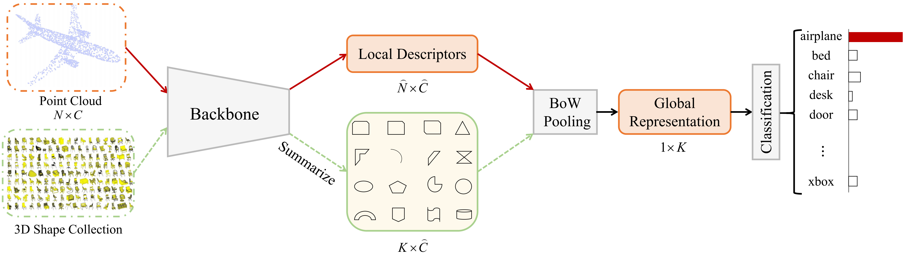
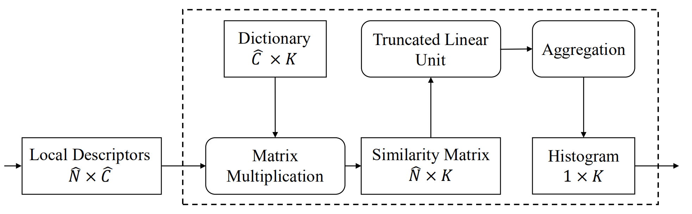

## BoW Pooling: A Plug-and-Play Unit for Feature Aggregation of Point Clouds
Created by Xiang Zhang, Xiao Sun, Zhouhui Lian from Peking University.

<!---->
<!---->
<p align="left">

</p>

<p align="left">

</p>

### Introduction

This work will appear in AAAI 2021. We propose the BoW pooling, a plug-and-play unit that substitutes for the symmetric functions in existing methods for the feature aggregation of point clouds. A novel dictionary update strategy is explored and discussed. The truncated Linear Unit is introduced to suppress the expression of unimportant local descriptors. You can also check out [paper]() for a deeper introduction.

Point cloud provides a compact and flexible representation for 3D shapes and recently attracts more and more attentions due to the increasing demands in practical applications. The major challenge of handling such irregular data is how to achieve the permutation invariance of points in the input.


In this repository, we release the code and data for BoW pooling for point cloud classification, shape retrieval and segmentation tasks.

### Citation

if you find our work useful in your research, please consider citing:

```
@article{zhang2021BowPooling,
  title={BoW Pooling: A Plug-and-Play Unit for Feature Aggregation of Point Clouds},
  author={Xiang Zhang, Xiao Sun, Zhouhui Lian},
  journal={AAAI 2021},
  year={2021}
}
```
### Environment
```
Linux Ubuntu 16.04
Python 3.6.5
PyTorch 1.0.0
Tensorflow 1.12.0
CUDA 9.0
```
### Usage

##### Data Preparation
Firstly, you should download the [ModelNet40 dataset](https://shapenet.cs.stanford.edu/media/modelnet40_ply_hdf5_2048.zip), [SHREC15 dataset](https://www.icst.pku.edu.cn/zlian/representa/3d15/dataset/index.htm) or [HDF5 files](https://drive.google.com/drive/folders/1c1vGv0WKmNM-h0N9Y1LuYcUv7OMtQe_k?usp=sharing), [ShapeNet part dataset](https://github.com/charlesq34/pointnet/blob/master/part_seg/download_data.sh) we use, [S3DIS dataset](https://shapenet.cs.stanford.edu/media/indoor3d_sem_seg_hdf5_data.zip).
<!--```-->

<!--```-->

##### Train Model

To train and evaluate BoW pooling for classification:

```bash
CUDA_VISIBLE_DEVICES='0, 1' python train.py
```

##### Test Model

The pretrained backbone model with BoW pooling weights are stored in [pretrained model](https://drive.google.com). You can download it.

To evaluate the BoW pooling for classification:

```bash
CUDA_VISIBLE_DEVICES='0, 1' python test.py
```
##### Usage Demo
```bash
import torch
from bow_pooling import Bow_Pooling
dictionary = torch.randint(0, 5, [4, 3])  # dictionary, [K, C], 4 clustering centers with 3-dim vector
inputs = torch.randint(0, 5, [2, 3, 5])  # points position data, [B, C, N], batch_size=2, 5 points with 3-dim vector
bow_pooling = Bow_Pooling(dictionary=dictionary)
result = bow_pooling(inputs)
```
### Licence

Our code is released under MIT License (see LICENSE file for details).
